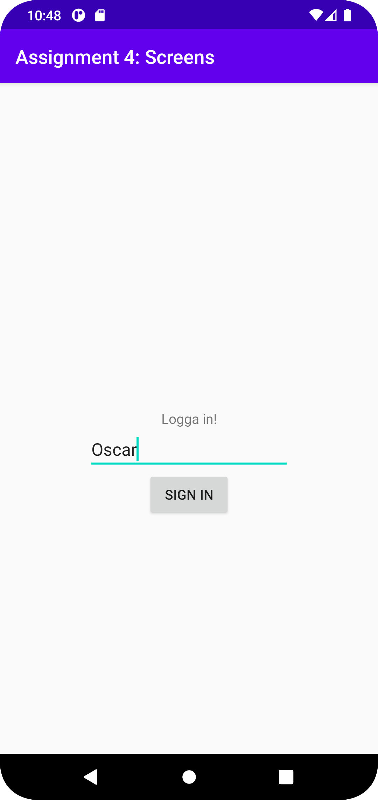
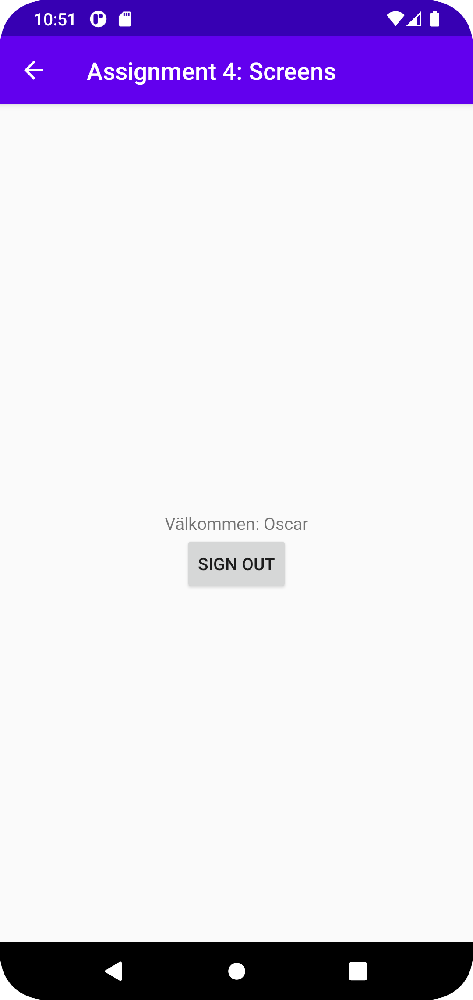

# Rapport

**Uppgift 4: Activities & Intents**

```
// Här skapar vi variabler för text-input fältet samt knappen som ligger under text-fältet.
// Efter det säger vi med hjälp av intents att "OnClick()", alltså när man trycker på knappen, ska man tas till "SecondActivity".
// Vi skickar med variabeln "username" som string med hjälp av extras.

protected void onCreate(Bundle savedInstanceState) {
    super.onCreate(savedInstanceState);
    setContentView(R.layout.activity_main);

    username = findViewById(R.id.signin_name);

    signIn = findViewById(R.id.signin_button);
    signIn.setOnClickListener(new View.OnClickListener() {

        @Override
        public void onClick(View view) {
            Log.d("==>", "Signed in!");
            Intent intent = new Intent(MainActivity.this, SecondActivity.class);
            intent.putExtra("username", username.getText(). toString());
            startActivity(intent);
        }
    });
}

// Här tar vi emot och använder oss av "username" variabeln som vi skrev in tidigare.
// Vi skapar även en knapp här, för att "logga ut".

protected void onCreate(Bundle savedInstanceState) {
    super.onCreate(savedInstanceState);
    setContentView(R.layout.activity_second);

    signout = findViewById(R.id.signout_button);
    usernameview = findViewById(R.id.welcome_text);

    Intent intent = getIntent();
    Bundle extras = intent.getExtras();

    String username = extras.getString("username");

    usernameview.setText("Välkommen: " + username);

    signout.setOnClickListener(new View.OnClickListener() {
        @Override
        public void onClick(View view) {
            Intent intent = new Intent(SecondActivity.this, MainActivity.class);
            startActivity(intent);
            finish();
        }
    });
}
```





Läs gärna:

- Boulos, M.N.K., Warren, J., Gong, J. & Yue, P. (2010) Web GIS in practice VIII: HTML5 and the canvas element for interactive online mapping. International journal of health geographics 9, 14. Shin, Y. &
- Wunsche, B.C. (2013) A smartphone-based golf simulation exercise game for supporting arthritis patients. 2013 28th International Conference of Image and Vision Computing New Zealand (IVCNZ), IEEE, pp. 459–464.
- Wohlin, C., Runeson, P., Höst, M., Ohlsson, M.C., Regnell, B., Wesslén, A. (2012) Experimentation in Software Engineering, Berlin, Heidelberg: Springer Berlin Heidelberg.
